# Dependency plan A → Z

Letters are in a valid **build order**: every workstream depends only on earlier letters. `plans/verify-plan.mjs` checks this (and that every requirement of every Malva spec is implemented by exactly the workstreams listed here). Status of the draft: **DRAFT v1** (2026-10-08). Specs: `openspec/changes/bootstrap-malva-storefront` (foundation, 5 specs) and `openspec/changes/malva-website` (7 specs).

## Workstreams

| ID | Workstream | Implements (OpenSpec capability) | Depends on | Owner prerequisites | Parallel with |
| --- | --- | --- | --- | --- | --- |
| A | Scaffold, tooling, quality gate | malva-project-bootstrap | — | — | — |
| B | Design tokens and fonts | malva-project-bootstrap (token hooks) | A | — | C, D, E |
| C | Locale routing and messages | malva-locale-routing | A | — | B, E |
| D | BFF core: client, session, health | malva-bff-and-session | A, C | OA-02, OA-03 | B, E |
| E | Seed: project config, catalog, roles, images | *(SEED-PLAN.md; models D2, D10)* | A | OA-01 | B, C, D |
| F | Business-unit context | malva-business-unit-context | D, E | OA-04 | — |
| G | Data-loading foundation and smoke test | malva-data-loading | B, C, D, E, F | — | — |
| H | Shell: top bar, nav, footer, shared components | malva-homepage (global chrome) | B, C, G | SO-01 | I |
| I | Managed content and sample markers | malva-homepage (proof content) | G | — | H |
| J | Homepage | malva-homepage | H, I | — | K, M |
| K | Service listings | malva-service-listing | E, G, H | — | J, M |
| L | Service detail pages | malva-service-detail | K | SO-03 | M |
| M | About page and privacy notice | malva-about | H, I | SO-02 | J, K, L |
| N | Registration and sign-in | malva-client-portal (registration, sign-in) | D, F, H | OA-04 | L, M |
| O | Portal shell, privacy, overview, company switch | malva-client-portal | H, N | — | P |
| P | Quote list | malva-quote-list | G, L, N | — | O |
| Q | Request a quote | malva-request-a-quote | N, P | — | — |
| R | Portal: quotes and requests | malva-client-portal (quotes) | O, Q | — | S, T |
| S | Portal: sites and team | malva-client-portal (sites, team) | O | — | R, T |
| T | Portal: visits, waste documents, invoices | malva-client-portal (data) | E, O | — | R, S |
| U | Abuse protection and security hardening | *(cross-cutting)* | N, Q | — | V |
| V | Accessibility sweep | *(cross-cutting)* | J, L, M, P, Q, R, S, T | SO-02 | U |
| W | Performance and caching verification | *(cross-cutting)* | V | — | X |
| X | SEO, sitemap and metadata audit | *(cross-cutting)* | J, L, M | SO-04 | W |
| Y | Deployment | *(hosting per Q-024)* | U, V, W, X | OA-05 | — |
| Z | Release readiness and final verification | all | A–Y | all OA, SO | — |

## Graph

```mermaid
graph LR
  A["A Scaffold, tooling, quality gate"] --> B["B Design tokens and fonts"]
  A["A Scaffold, tooling, quality gate"] --> C["C Locale routing and messages"]
  A["A Scaffold, tooling, quality gate"] --> D["D BFF core: client, session, health"]
  C["C Locale routing and messages"] --> D["D BFF core: client, session, health"]
  A["A Scaffold, tooling, quality gate"] --> E["E Seed: project config, catalog, roles, images"]
  D["D BFF core: client, session, health"] --> F["F Business-unit context"]
  E["E Seed: project config, catalog, roles, images"] --> F["F Business-unit context"]
  B["B Design tokens and fonts"] --> G["G Data-loading foundation and smoke test"]
  C["C Locale routing and messages"] --> G["G Data-loading foundation and smoke test"]
  D["D BFF core: client, session, health"] --> G["G Data-loading foundation and smoke test"]
  E["E Seed: project config, catalog, roles, images"] --> G["G Data-loading foundation and smoke test"]
  F["F Business-unit context"] --> G["G Data-loading foundation and smoke test"]
  B["B Design tokens and fonts"] --> H["H Shell: top bar, nav, footer, shared components"]
  C["C Locale routing and messages"] --> H["H Shell: top bar, nav, footer, shared components"]
  G["G Data-loading foundation and smoke test"] --> H["H Shell: top bar, nav, footer, shared components"]
  G["G Data-loading foundation and smoke test"] --> I["I Managed content and sample markers"]
  H["H Shell: top bar, nav, footer, shared components"] --> J["J Homepage"]
  I["I Managed content and sample markers"] --> J["J Homepage"]
  E["E Seed: project config, catalog, roles, images"] --> K["K Service listings"]
  G["G Data-loading foundation and smoke test"] --> K["K Service listings"]
  H["H Shell: top bar, nav, footer, shared components"] --> K["K Service listings"]
  K["K Service listings"] --> L["L Service detail pages"]
  H["H Shell: top bar, nav, footer, shared components"] --> M["M About page and privacy notice"]
  I["I Managed content and sample markers"] --> M["M About page and privacy notice"]
  D["D BFF core: client, session, health"] --> N["N Registration and sign-in"]
  F["F Business-unit context"] --> N["N Registration and sign-in"]
  H["H Shell: top bar, nav, footer, shared components"] --> N["N Registration and sign-in"]
  H["H Shell: top bar, nav, footer, shared components"] --> O["O Portal shell, privacy, overview, company switch"]
  N["N Registration and sign-in"] --> O["O Portal shell, privacy, overview, company switch"]
  G["G Data-loading foundation and smoke test"] --> P["P Quote list"]
  L["L Service detail pages"] --> P["P Quote list"]
  N["N Registration and sign-in"] --> P["P Quote list"]
  N["N Registration and sign-in"] --> Q["Q Request a quote"]
  P["P Quote list"] --> Q["Q Request a quote"]
  O["O Portal shell, privacy, overview, company switch"] --> R["R Portal: quotes and requests"]
  Q["Q Request a quote"] --> R["R Portal: quotes and requests"]
  O["O Portal shell, privacy, overview, company switch"] --> S["S Portal: sites and team"]
  E["E Seed: project config, catalog, roles, images"] --> T["T Portal: visits, waste documents, invoices"]
  O["O Portal shell, privacy, overview, company switch"] --> T["T Portal: visits, waste documents, invoices"]
  N["N Registration and sign-in"] --> U["U Abuse protection and security hardening"]
  Q["Q Request a quote"] --> U["U Abuse protection and security hardening"]
  J["J Homepage"] --> V["V Accessibility sweep"]
  L["L Service detail pages"] --> V["V Accessibility sweep"]
  M["M About page and privacy notice"] --> V["V Accessibility sweep"]
  P["P Quote list"] --> V["V Accessibility sweep"]
  Q["Q Request a quote"] --> V["V Accessibility sweep"]
  R["R Portal: quotes and requests"] --> V["V Accessibility sweep"]
  S["S Portal: sites and team"] --> V["V Accessibility sweep"]
  T["T Portal: visits, waste documents, invoices"] --> V["V Accessibility sweep"]
  V["V Accessibility sweep"] --> W["W Performance and caching verification"]
  J["J Homepage"] --> X["X SEO, sitemap and metadata audit"]
  L["L Service detail pages"] --> X["X SEO, sitemap and metadata audit"]
  M["M About page and privacy notice"] --> X["X SEO, sitemap and metadata audit"]
  U["U Abuse protection and security hardening"] --> Y["Y Deployment"]
  V["V Accessibility sweep"] --> Y["Y Deployment"]
  W["W Performance and caching verification"] --> Y["Y Deployment"]
  X["X SEO, sitemap and metadata audit"] --> Y["Y Deployment"]
  A["A Scaffold, tooling, quality gate"] --> Z["Z Release readiness and final verification"]
  B["B Design tokens and fonts"] --> Z["Z Release readiness and final verification"]
  C["C Locale routing and messages"] --> Z["Z Release readiness and final verification"]
  D["D BFF core: client, session, health"] --> Z["Z Release readiness and final verification"]
  E["E Seed: project config, catalog, roles, images"] --> Z["Z Release readiness and final verification"]
  F["F Business-unit context"] --> Z["Z Release readiness and final verification"]
  G["G Data-loading foundation and smoke test"] --> Z["Z Release readiness and final verification"]
  H["H Shell: top bar, nav, footer, shared components"] --> Z["Z Release readiness and final verification"]
  I["I Managed content and sample markers"] --> Z["Z Release readiness and final verification"]
  J["J Homepage"] --> Z["Z Release readiness and final verification"]
  K["K Service listings"] --> Z["Z Release readiness and final verification"]
  L["L Service detail pages"] --> Z["Z Release readiness and final verification"]
  M["M About page and privacy notice"] --> Z["Z Release readiness and final verification"]
  N["N Registration and sign-in"] --> Z["Z Release readiness and final verification"]
  O["O Portal shell, privacy, overview, company switch"] --> Z["Z Release readiness and final verification"]
  P["P Quote list"] --> Z["Z Release readiness and final verification"]
  Q["Q Request a quote"] --> Z["Z Release readiness and final verification"]
  R["R Portal: quotes and requests"] --> Z["Z Release readiness and final verification"]
  S["S Portal: sites and team"] --> Z["Z Release readiness and final verification"]
  T["T Portal: visits, waste documents, invoices"] --> Z["Z Release readiness and final verification"]
  U["U Abuse protection and security hardening"] --> Z["Z Release readiness and final verification"]
  V["V Accessibility sweep"] --> Z["Z Release readiness and final verification"]
  W["W Performance and caching verification"] --> Z["Z Release readiness and final verification"]
  X["X SEO, sitemap and metadata audit"] --> Z["Z Release readiness and final verification"]
  Y["Y Deployment"] --> Z["Z Release readiness and final verification"]
```

<!-- GRAPH:BEGIN (generated by plans/verify-plan.mjs --sync) -->

<!-- GRAPH:END -->

## Critical path
`A → C → D → F → G → H → N → P → Q → R → V → W → Y → Z`. E (seed) is off the path only if it finishes before F and K start; schedule it **right after A** because every data-driven page needs the seeded catalog.

## Parallel lanes (when more than one junior is available)
| Wave | Workstreams that can run at the same time |
| --- | --- |
| 1 | A |
| 2 | B, C, E |
| 3 | D |
| 4 | F |
| 5 | G |
| 6 | H, I |
| 7 | J, K, M |
| 8 | L, N |
| 9 | O, P |
| 10 | Q, S, T |
| 11 | R, U |
| 12 | V |
| 13 | W, X |
| 14 | Y |
| 15 | Z |

## Gates (what must be true before the next wave)
| Gate | Condition | Checked by |
| --- | --- | --- |
| G1 after A | clean clone → `npm ci` → `npm run check` → `npm run build` green | Claude |
| G2 after D+E | `/api/health` returns the project key; seeded catalog (12 services, 2 categories, store, selection, roles) read back through the Merchant Center MCP; Product Search returns 12 services | Claude (MCP + browser) |
| G3 after G | `/en-US` placeholder renders with tokens and messages, no console errors; `next build` route table shows it static | Claude (browser) |
| G4 after H | shell on every page, keyboard focus visible, mobile menu works at 375 px | Claude (browser) |
| G5 after N | register → signed in → sign out → sign in round-trip; cookie HTTP-only, ids only | Claude (browser) |
| G6 after Q | a visitor with no account submits a request: account, Business Unit and Quote Request exist in the Merchant Center | Claude (browser + MCP) |
| G7 after T | portal lists and downloads work for the demo company and are invisible to another company | Claude (browser) |
| G8 after Y | deployed site passes the Z checklist | Claude + owner SO |

## What blocks what (owner prerequisites, in the order needed)
1. **OA-01** the `spec-b2b-manufacturing` Merchant Center MCP connected, plus a seed admin API client (before E can run against a project). 2. **OA-02/03** Frontend API client and session secret (before D). 3. **OA-04** provisioning API client (before F/N). 4. **SO-01** mobile menu (not designed). 5. **OA-05** hosting (before Y). Exact steps: `TODO-MANUAL-TESTING.md`.
