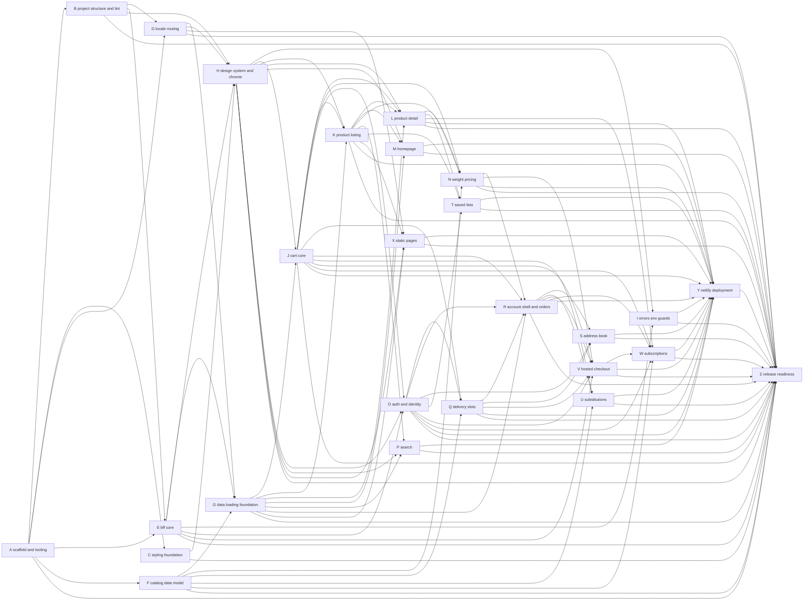

# Dependency plan A → Z

Letters are in a valid **build order**: every workstream depends only on earlier letters. `node plan/verify-plan.mjs` (from the repo root) checks this automatically; `--sync` regenerates the graph, STATUS counts and the manual-test table.

## Workstreams

| ID | Workstream | Implements specs | Depends on | Owner prerequisites | Unblocks (generated) |
| --- | --- | --- | --- | --- | --- |
| A | Scaffold, tooling, verify script | storefront-platform-stack, storefront-delivery-quality (verify) | — | — | B, C, D, E, F, Z |
| B | Project structure and lint rules | storefront-project-structure | A | — | D, E, H, Z |
| C | Styling foundation and tokens | storefront-styling-foundation | A | — | H, Z |
| D | Locale routing and messages | storefront-locale-routing | A, B | — | G, H, X, Z |
| E | BFF core: client, session, env, health | storefront-bff-and-session (core) | A, B | OA-02 | G, H, I, O, V, Z |
| F | Catalog data model: inspect + seed | catalog-data-model | A | OA-01, OA-03, OA-04 | G, N, Q, U, W, Z |
| G | Data-loading foundation: types, mappers, catalog reads | storefront-data-loading | D, E, F | — | J, K, L, M, P, R, X, Z |
| H | Design system primitives and chrome | storefront-design-system | B, C, D, E | — | I, J, K, L, M, O, P, X, Z |
| I | Error pages, env validation, secret guards | storefront-delivery-quality (errors, env) | E, H | — | Y, Z |
| J | Cart core: API, hooks, bag, availability, toast | cart-design, storefront-data-loading (cart) | G, H | — | K, L, N, O, Q, R, U, V, W, Y, Z |
| K | Product listing (PLP) | plp-design | G, H, J | — | L, M, N, P, T, X, Y, Z |
| L | Product detail (PDP) | pdp-design | G, H, J, K | — | N, T, W, Y, Z |
| M | Homepage | homepage-design | G, H, K | — | Y, Z |
| N | Weight pricing | weight-pricing-experience | F, J, K, L | — | R, V, Y, Z |
| O | Auth pages and identity | auth-pages-design, storefront-bff-and-session (login) | E, H, J | — | Q, R, S, T, V, W, Y, Z |
| P | Search | search-design | G, H, K | — | Y, Z |
| Q | Delivery slots and address step | delivery-slot-experience | F, J, O | — | R, S, V, Y, Z |
| R | Account shell, orders list and detail | account-design | G, J, N, O, Q | — | S, U, V, W, Y, Z |
| S | Address book | address-book-design | O, Q, R | — | Y, Z |
| T | Saved lists | saved-lists-design | K, L, O | — | Y, Z |
| U | Substitutions | substitution-experience | F, J, R | OA-07 | Y, Z |
| V | Hosted checkout and confirmation | checkout-design, storefront-bff-and-session (session), storefront-data-loading (order) | E, J, N, O, Q, R | OA-05 | W, Y, Z |
| W | Subscriptions | subscription-experience | F, J, L, O, R, V | OA-05 (spike) | Y, Z |
| X | Static pages | static-pages-design | D, G, H, K | — | Y, Z |
| Y | Netlify deployment | storefront-delivery-quality (deploy) | I–X | OA-06 | Z |
| Z | Release readiness and final verification | all | A–Y | all OA-* | — |

## Graph (generated)

<!-- GRAPH:BEGIN (generated by plan/verify-plan.mjs --sync) -->

<!-- GRAPH:END -->

## Critical path
A → B → D → G → J → O → Q → R → V → W → Y → Z (11 steps; E, F and H join before J). Everything else hangs off it.

## Suggested team schedule (two developers)

| Phase | Dev 1 | Dev 2 |
| --- | --- | --- |
| 1 | A → B → D | (waits for A) C |
| 2 | E | F (needs OA-01/OA-03/OA-04) |
| 3 | G | H |
| 4 | J → I | K |
| 5 | L | O |
| 6 | M, N | P, X |
| 7 | Q → R | T |
| 8 | S, U | V |
| 9 | W (spike first, Gate 3) | (support/tests) |
| 10 | Y → Z | Z |

## Gates (owner checks before the next phase)
- **Gate 1 (after F):** `PROJECT-FINDINGS.md` reviewed; seeded data visible in Merchant Center (M-F-*).
- **Gate 2 (after K, L, J):** catalog → cart flow works against the real project (M-K-*, M-L-*, M-J-*).
- **Gate 3 (after V, before W's UI):** the R-1 spike (task W-01, runs on the finished hosted checkout) is approved by the owner.
- **Gate 4 (before V):** OA-05 complete (Checkout application + Adyen test connector).
- **Gate 5 (before Y):** all `SO-*` sign-offs approved.

## Blocking owner actions
OA-01 (.envrc for MCP) blocks F inspection and Claude verification. OA-02 blocks E tests against the live project (unit tests do not need it). OA-03 blocks the seed run in F. OA-05 blocks V (hosted checkout) and the W subscription spike. OA-06 blocks Y.
