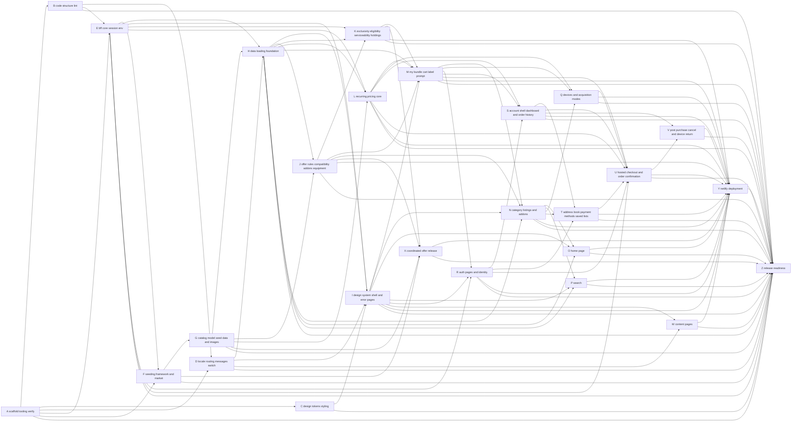

# Dependency plan A → Z

Letters are in a valid **build order**: every workstream depends only on earlier letters. `node plan/verify-plan.mjs` (from the repo root `b2c-telecom/`) checks this automatically; `--sync` regenerates the graph, STATUS counts and the manual-test and verification tables.

## Workstreams

| ID | Workstream | Implements specs | Depends on | Owner prerequisites | Unblocks (generated) |
| --- | --- | --- | --- | --- | --- |
| A | Scaffold, tooling, verify script | storefront-project-bootstrap | — | — | B, C, D, E, F, Z |
| B | Code structure and lint rules | storefront-code-structure | A | — | D, E, Z |
| C | Design tokens, fonts, styling foundation | design-system-tokens | A | — | I, Z |
| D | Locale routing, messages, region and language switch | switching-region-or-language | A, B | — | H, I, W, Z |
| E | BFF core: commercetools client, session, env guards, identity core | authentication-and-identity (core) | A, B | OA-02 | F, H, I, K, L, R, U, Z |
| F | Seeding framework, project settings, market and shipping | seeding-framework, seed-shipping-and-market-settings | A, E | OA-03, OA-04 | G, X, Z |
| G | Catalog model, seed data and images | telecom-catalog-model, seed-catalog-data, seed-product-images-pexels | F | — | H, J, L, X, Z |
| H | Data-loading foundation: types, mappers, catalog and search reads | discovery-and-browse | D, E, G | — | I, J, K, L, M, N, O, P, Z |
| I | Design system primitives, shell and error pages | storefront-shell, error-pages | C, D, E, H | — | M, N, O, P, R, W, Y, Z |
| J | Offer rules: compatibility, add-ons, required equipment | configurable-offers-and-compatibility, offer-compatible-addons | G, H | — | K, M, N, X, Y, Z |
| K | Exclusivity and eligibility: serviceability, holdings | mutually-exclusive-offers, eligibility-gated-offer | E, H, J | — | M, X, Y, Z |
| L | Recurring pricing core: price modes, intro and phased schedules, subscriptions, checkout spike | introductory-period-price, term-phased-price-schedule, subscriptions-and-recurring-orders | E, G, H | OA-05 (spike) | M, Q, S, U, Y, Z |
| M | My bundle (cart), Broadband Facts label, discount prompt | cart-management, cart-page, broadband-facts-label, discount-activating-offer-prompt | H, I, J, K, L | — | N, Q, R, S, U, Y, Z |
| N | Category listings and add-ons page | product-listing-page, plp-led-catalog-navigation | H, I, J, M | — | O, P, Q, T, Y, Z |
| O | Home page | home-landing-page | H, I, N | — | Y, Z |
| P | Search | search-results-page | H, I, N | — | Y, Z |
| Q | Devices and acquisition modes | device-acquisition-mode | L, M, N | — | U, Y, Z |
| R | Auth pages and identity | account-sign-in, email-verification, password-reset | E, I, M | — | S, T, U, Y, Z |
| S | Account shell, dashboard and order history | account-and-self-service, account-dashboard, order-history | L, M, R | — | T, U, V, Y, Z |
| T | Address book, payment methods, saved lists | address-book, payment-methods, saved-lists | N, R, S | — | U, Y, Z |
| U | Hosted checkout and order confirmation | checkout, checkout-page, order-confirmation-page | E, L, M, Q, R, S, T | OA-05 | V, Y, Z |
| V | Post-purchase: cancel and device return | post-purchase-order-management | S, U | — | Y, Z |
| W | Content pages: about, FAQ, blog, policies, support | about-us, faq, blog-resources, policy-pages, contact-us | D, I | — | Y, Z |
| X | Coordinated offer release | coordinated-offer-release | F, G, J, K | — | Y, Z |
| Y | Netlify deployment | storefront-project-bootstrap (deploy) | I–X | OA-06 | Z |
| Z | Release readiness, spec reconciliation, final verification | all (agent-redemption-quota, account-registration-request, product-detail-page recorded as deferred/superseded) | A–Y | all OA-* | — |

## Graph (generated)

<!-- GRAPH:BEGIN (generated by plan/verify-plan.mjs --sync) -->

<!-- GRAPH:END -->

## Critical path
A → B → E → F → G → H → J → K → M → N → Q → U → V → Y → Z (14 steps; D, C, I, L, R, S, T join before U). W, X, O, P hang off the middle and can run in parallel.

## Parallel lanes (two developers)

| Phase | Dev 1 | Dev 2 |
| --- | --- | --- |
| 1 | A → B | (waits for A) C |
| 2 | E → F | D |
| 3 | G | H (after G) |
| 4 | J → K | I |
| 5 | L (spike first) | W |
| 6 | M | X |
| 7 | N → Q | O, P |
| 8 | R → S | T |
| 9 | U (needs OA-05 + Gate 4) | V |
| 10 | Y → Z | Z |

## Gates (checked by Claude with Chrome before the next phase; owner only for OA/SO)
- **Gate 1 (after G):** seeded catalog visible through the commerce MCP and `npm run seed:verify` green; furniture data removed (needs OA-04 approval).
- **Gate 2 (after L; Q-03 repeats part of it for devices):** the checkout spike (L-08) proves recurring lines + one-time lines + hosted Checkout session in one cart (or records the fallback in `PROJECT-FINDINGS.md`); owner reviews the finding.
- **Gate 3 (after N):** catalog → bundle flow works in Chrome on the seeded project: add plan, add-on, equipment; conflicts and incompatibilities shown (`VERIFICATION-LOG.md` C-N-*).
- **Gate 4 (before U):** OA-05 done (Checkout application + Adyen test connector with stored payment methods and recurring support).
- **Gate 5 (before Y):** all `SO-*` sign-offs approved or explicitly waived.

## Blocking owner actions
OA-02 blocks E live checks (unit tests do not need it). OA-03 + OA-04 block the seed run and the furniture cleanup in F/G. OA-05 blocks L's spike and U. OA-06 blocks Y. Details: `TODO-MANUAL-TESTING.md`.
